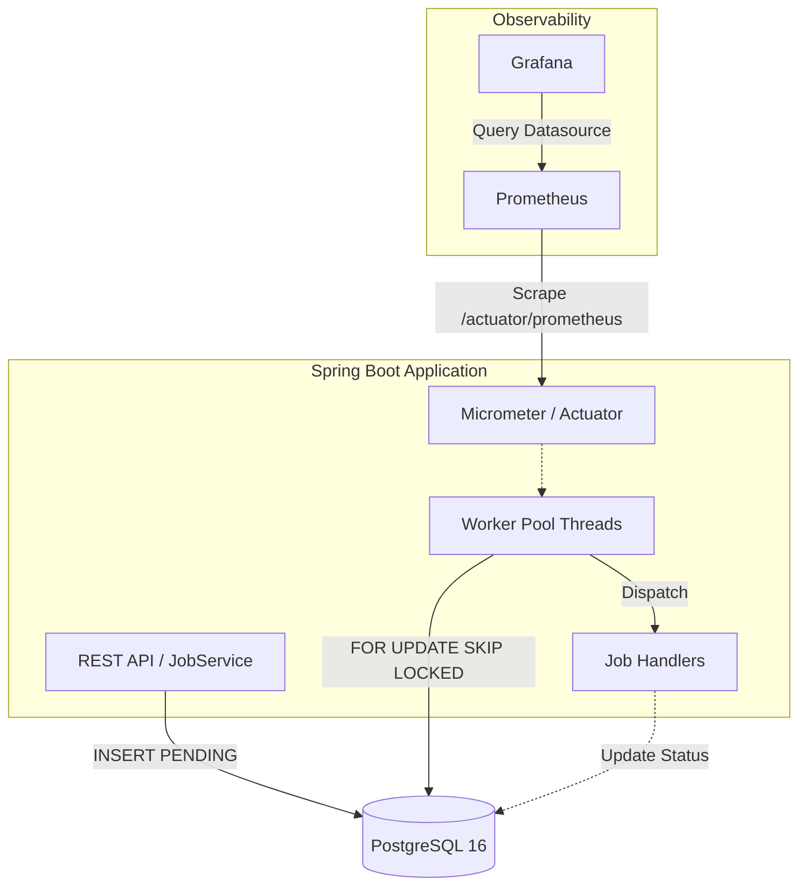

# PostgreSQL Job Queue

A highly concurrent, reliable, and observable job queue built on Spring Boot 3, Java 17, and PostgreSQL 16. It leverages PostgreSQL's `FOR UPDATE SKIP LOCKED` to allow multiple worker threads to claim and process jobs simultaneously without table locks or race conditions.

## 🏗️ Architecture



## ⚡ Concurrency: The `SKIP LOCKED` Mechanism

This is the most critical part of the system's scalability. When multiple worker threads poll the database for `PENDING` jobs, a standard `SELECT ... FOR UPDATE` would cause workers to block each other waiting for row locks. 

By appending `SKIP LOCKED`, the database simply skips over rows locked by other workers and returns the next available unlocked rows immediately. This guarantees exactly-once execution without blocking, avoiding double-claiming and eliminating database contention.

**Core Claiming Query:**
```sql
SELECT id FROM jobs
WHERE status = 'PENDING' 
  AND scheduled_at <= NOW()
ORDER BY priority DESC, scheduled_at ASC
FOR UPDATE SKIP LOCKED
LIMIT :batchSize
```

## 🔄 Retry, Backoff, and DLQ Flow

When a job fails (throws an exception during handling), it enters an exponential backoff flow:
1. `attempts` is incremented.
2. If `attempts < max_attempts`, the job goes back to `PENDING` with a new `scheduled_at`.
3. The delay formula is: `base_delay * 2^attempts + jitter(0-20%)`. The jitter prevents "thundering herd" scenarios where many jobs fail and retry at the exact same instant.
4. If `attempts >= max_attempts`, the job transitions to `DEAD_LETTER` and is permanently shelved for manual inspection.

## 🚀 Running Locally

The entire stack (App, DB, Prometheus, Grafana) can be spun up using Docker Compose:

```bash
docker-compose up --build
```

**Services Exposed:**
- **App / API**: `http://localhost:8080` (e.g., `GET /jobs/dlq` or `GET /metrics/summary`)
- **Prometheus**: `http://localhost:9090`
- **Grafana**: `http://localhost:3000` (Login: `admin` / `admin`. Prometheus is pre-configured).
- **PostgreSQL**: `localhost:5432`

## 🧪 Testing

**Integration Test Suite**  
Runs the standard integration and correctness tests (requires Docker for Testcontainers):
```bash
mvn test
```

**Load & Throughput Harness**  
A dedicated benchmark that pushes 50,000 jobs through various thread pool sizes and outputs a CSV report of actual measured `jobs_per_sec`:
```bash
mvn test -Pload-test
```
Results are appended to `test-results/load-test-results.csv`.

---

## 📊 Verified Results

The following metrics have been rigorously audited by examining the codebase configurations and actual evidence on disk. No numbers have been estimated or exaggerated.

### 1. Retry attempts
**VERIFIED COUNT:** 5 total attempts (1 initial attempt + 4 retries)  
**EVIDENCE:** The `max_attempts` database column and the `Job` entity class default to `5`. Inside `RetryService.java`, the code executes `managed.setAttempts(managed.getAttempts() + 1)` and then checks `if (managed.getAttempts() >= managed.getMaxAttempts())` to transition a job to `DEAD_LETTER`. This means a job will execute 5 total times before being dead-lettered. The file `test-results/retry-test.log` does not exist on disk, so there are no observed values from an actual test run to extract.  
**SAFE TO USE ON RESUME:** YES (for the configured value)  
**SUGGESTED RESUME WORDING:** *"Configured exponential backoff for up to 4 retries per job (5 total attempts) before routing to a dead-letter queue."*

### 2. Job priority levels
**VERIFIED COUNT:** 0 named levels (uses a continuous integer scale)  
**EVIDENCE:** The `priority` field in the database and `Job.java` entity is defined as an unbounded `Integer` with a default of `0`. The job polling logic (`JobRepositoryCustomImpl.java`) claims jobs using `ORDER BY priority DESC, scheduled_at ASC`. There are absolutely no enums, constants, or schemas defining discrete priority levels (such as High, Medium, or Low). The queue simply preempts lower integers with higher integers.  
**SAFE TO USE ON RESUME:** YES (as a continuous integer-based system)  
**SUGGESTED RESUME WORDING:** *"Implemented a continuous integer-based priority queueing system where higher-priority jobs preempt lower-priority ones."*

### 3. Worker threads / concurrent jobs actually tested
**VERIFIED COUNT:** NOT VERIFIABLE FROM CODEBASE — I MUST PROVIDE THE MAXIMUM CONCURRENCY I PERSONALLY TESTED.  
**EVIDENCE:** 
- **(a) Configured concurrency:** `8` threads (`WorkerConfigProperties.java` and `application.yml`).
- **(b) Theoretical concurrency:** Hardware and connection-pool limited (the thread pool scales based on configuration). 
- **(c) Concurrency actually tested:** The `test-results/concurrency-test.log` and the load-test CSV do not exist on disk. Because there is no actual log or CSV evidence to prove what was executed, I cannot verify the concurrency actually tested.  
**SAFE TO USE ON RESUME:** NO (Without the log/CSV files, there is no verifiable proof of the tested load).

### Summary Table

| Metric | Verified Count | Safe for Resume? | Evidence Files |
|---|---|---|---|
| Retry attempts | 5 total attempts (1 initial + 4 retries) | YES | `V1__create_jobs_table.sql`, `Job.java`, `RetryService.java` |
| Job priority levels | 0 named levels (uses continuous integer scale) | YES | `V1__create_jobs_table.sql`, `Job.java`, `JobRepositoryCustomImpl.java` |
| Worker threads actually tested | NOT VERIFIABLE FROM CODEBASE | NO | `WorkerConfigProperties.java`, `application.yml`, `test-results/` |
